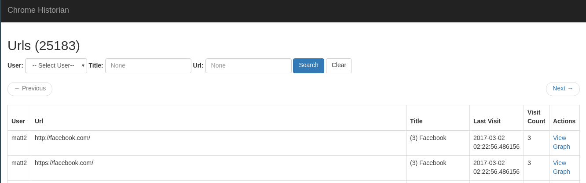
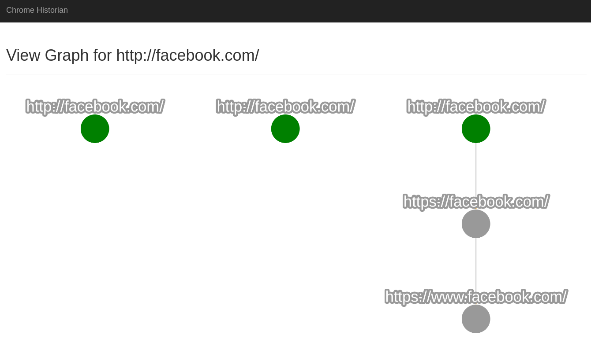

Usage
=====

Whether you are using the text or web interface the setup is the same. You will need to gather the
chrome histories you want to view into one directory. The filenames of these histories will be
treated as the username that history belongs to. Historian provides two scripts to aid in this
task located in the ``scripts`` directory.

The following examples assume you have a collection of histories in ``~histories``.

Text Interface
--------------

To inspect a users history in the CLI you can run the following command:

.. code-block:: bash

   chrome-historian -d ~/histories -m merged.db inspect

This command will case historian to merge all of the histories in the folder specified by ``-d``,
into one database located at the path specified by ``-m``.

An example session is shown below:

.. code-block:: bash

   historian [merged.db]> db
   historian>DB> list
   +All Users------+
   | ID | Username |
   +----+----------+
   | 1  | mattg    |
   | 2  | other    |
   +----+----------+
   historian>DB> user 1
   historian>DB (mattg)> search url github.com/mgerst/chrome-historian
   +Search Results----------------------------------------------------------+----------------------------------+
   | ID    | URL                                                            | TITLE                            |
   +-------+----------------------------------------------------------------+----------------------------------+
   | 58067 | https://github.com/mgerst/chrome-historian                     | mgerst/chrome-historian          |
   | 58097 | https://github.com/mgerst/chrome-historian/issues              | Issues * mgerst/chrome-historian |
   +-------+----------------------------------------------------------------+----------------------------------+
   historian>DB (mattg)> inspect 58067
   hist>(mattg)>url 58067> info
   +-------------+--------------------------------------------+
   | ID          | 58067                                      |
   | Url         | https://github.com/mgerst/chrome-historian |
   | Title       | Issues * mgerst/chrome-historian           |
   | Visit Count | 13                                         |
   | Last Visit  | 2017-12-19 04:44:12.183030                 |
   | Typed Count | 0                                          |
   +-------------+--------------------------------------------+

You can even use the ``visits`` command to view all the times a url was visisted.

.. code-block:: bash

   hist>(mattg)>url 58067> visits
   +Visits for URL 58067-----------------+------+------------------------------------+--------+
   | ID     | TIME                       | TYPE | FLAGS                              | FROM   |
   +--------+----------------------------+------+------------------------------------+--------+
   | 254491 | 2017-10-19 23:11:11.872131 | LINK | CHAIN_END|CHAIN_START              | 254490 |
   | 254494 | 2017-10-19 23:16:56.743393 | LINK | CHAIN_END|CHAIN_START              | 0      |
   | 254497 | 2017-10-19 23:17:02.764693 | LINK | CHAIN_END|CHAIN_START              | 0      |
   | 254498 | 2017-10-19 23:17:03.220186 | LINK | CHAIN_END|CHAIN_START              | 0      |
   | 254500 | 2017-10-19 23:17:09.259315 | LINK | CHAIN_END|CHAIN_START|FORWARD_BACK | 0      |
   | 278854 | 2017-12-19 04:02:10.729247 | LINK | CHAIN_END|CHAIN_START              | 0      |
   | 278855 | 2017-12-19 04:02:11.161222 | LINK | CHAIN_END|CHAIN_START              | 0      |
   | 278898 | 2017-12-19 04:15:20.734545 | LINK | CHAIN_END|CHAIN_START              | 0      |
   | 278899 | 2017-12-19 04:15:21.187774 | LINK | CHAIN_END|CHAIN_START              | 0      |
   | 278984 | 2017-12-19 04:43:44.892232 | LINK | CHAIN_END|CHAIN_START              | 278983 |
   | 278985 | 2017-12-19 04:43:56.128881 | LINK | CHAIN_END|CHAIN_START              | 0      |
   | 278988 | 2017-12-19 04:44:00.286482 | LINK | CHAIN_END|CHAIN_START|FORWARD_BACK | 0      |
   | 278992 | 2017-12-19 04:44:12.183030 | LINK | CHAIN_END|CHAIN_START|FORWARD_BACK | 0      |
   +--------+----------------------------+------+------------------------------------+--------+

Web Interface
-------------
The web interface can be started with the following command:

.. code-block:: bash

   chrome-historian -d ~/historians -m merged.db server

You can now view the web interface at ``http://localhost:5000``.

   The URL list contains options for filtering and searching the list of urls in the combined histories. It also
   shows some common information such as the timestamp of the last visit and how many times the url has been visisted.

   The View Graph shows every instance of the url being visited, as well as the path taken to and from those visits.
   Clicking on a node gives more information about the visit.
